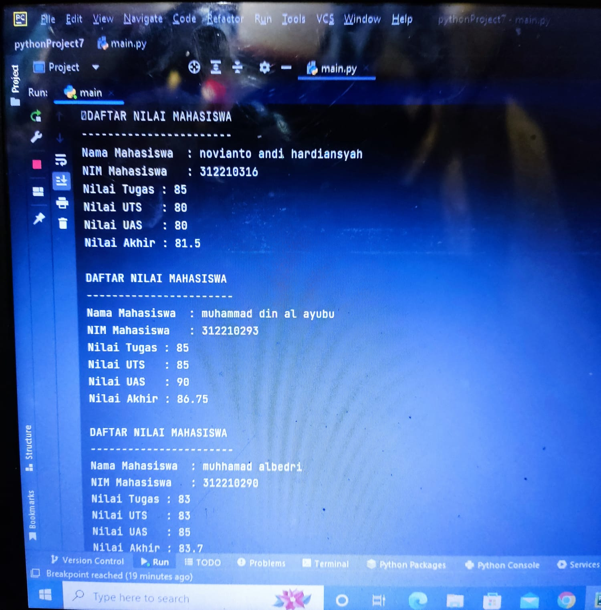

# praktikum7
## Novianto Andi Hardiansyah 
## NIM:312210316
## Kelas:TI 22 A3

### tugas praktikum 7

### penjelasan
+ Untuk memanggil fungsi dengan nama "os".
+ Membuat class data_mhsw dengan atributnya, yaiutu nama, nim, tugas, uts, dan uas.
+ Membuat variabel data = [] untuk menampung list dari data_mhsw.
+ Membuat fungsi tambahan jika diperlukan fun gsi tersebut akan dipanggil oleh program.
+ Menampilkan data (lihat())
+ Jika belum menginput data, makan akan memanggil fungsi no_data().
+ Jika sebelumnya sudah menginput data, maka data sudah diinputkan akan di tampilkan oleh program.
+ Menambahkan data (Tambah())
+ Menginput NIM, NAMA, Nilai Tugas, Nilai UTS, Nilai UAS.
+ Jika data sudah diinpit akan ditambahkan kedalam variabel data.
+ Mengubah data (Ubah())
+ Menginput Nama, kemudian input data yang ingin di ubah.
+ Menghapus data (Hapus())
+ Menginput Nama, setalah Nama diinputkan maka data yang lainnya akan ikut terhapus sesuai dengan nama yang diinputkan.
+ Menggunakan Perulangan uncountable, yang artinya selama statement bernilai True maka program akan terus berjalan. Jika statementnya False maka program akan terhenti.

